# Project Niferche - Visual Sitemap

```mermaid
graph TB
    Home["Home (/)"] --> Announcements["/announcements"]
    Home --> Introduction["/introduction"]
    Home --> Gallery["/gallery"]
    
    PNMain["Project Niferche (/project-niferche/top)"] --> MainStory["/project-niferche/main-story"]
    PNMain --> SideStory["/project-niferche/side-story"]
    PNMain --> Materials["/project-niferche/materials"]
    
    MainStory --> MainStoryChapter["/project-niferche/main-story/:chapterId"]
    SideStory --> SideStoryDetail["/project-niferche/side-story/:storyId"]
    Materials --> MaterialDetail["/project-niferche/materials/:materialId"]
    Materials --> WorldMaterials["/project-niferche/materials/world/:worldId"]
    
    LabHome["Laboratory (/laboratory/home)"] --> Parallel["/laboratory/parallel"]
    LabHome --> LCB["/laboratory/lcb"]
    LabHome --> Experiments["/laboratory/experiments"]
    
    Parallel --> ParallelSection["/laboratory/parallel/:section"]
    LCB --> LCBSection["/laboratory/lcb/:section"]
    Experiments --> Game["/laboratory/experiments/game"]
    Experiments --> Interactive["/laboratory/experiments/interactive"]
    
    Demo["Demo"] --> WorldNavDemo["/demo/world-navigation"]
    
    subgraph "Main Navigation"
        Home
        PNMain
        LabHome
        Demo
    end
    
    subgraph "World-Based Navigation"
        Hodemei["Hodemei World"]
        Quxe["Quxe World"]
        Alsarejia["Alsarejia World"]
        LabWorld["Laboratory World"]
        Common["Common"]
    end
    
    Hodemei -.-> Materials
    Quxe -.-> Materials
    Alsarejia -.-> Materials
    LabWorld -.-> LabHome
    Common -.-> Home
```

## Navigation Systems

### 1. Section-Based Navigation
Represented by the top level of the graph, this navigation allows users to move between the main sections of the application:
- Home section
- Project Niferche section
- Laboratory section
- Demo section

### 2. World-Based Navigation
Represented by the bottom part of the graph, this navigation allows users to explore content organized by conceptual "worlds":
- Hodemei World
- Quxe World
- Alsarejia World
- Laboratory World
- Common content

The dotted lines represent the connections between worlds and their relevant content sections.

## Content Organization

### Project Niferche Content
Content is organized hierarchically:
- Main story chapters
- Side stories with details
- Materials categorized by world

### Laboratory Content
Experimental and interactive content:
- Parallel sections with tabbed interface
- LCB sections with linear navigation
- Interactive experiments and games

## Key Pages and Their Relationships

### Home Section
- Home (/) - Main entry point
- Announcements - News and updates
- Introduction - About information
- Gallery - Visual content

### Project Niferche Section
- Main Page - Section overview
- Story Pages - Narrative content
- Materials - Reference materials

### Laboratory Section 
- Laboratory Home - Section entry
- Parallel - Split-view content
- LCB - Linear content blocks
- Experiments - Interactive features